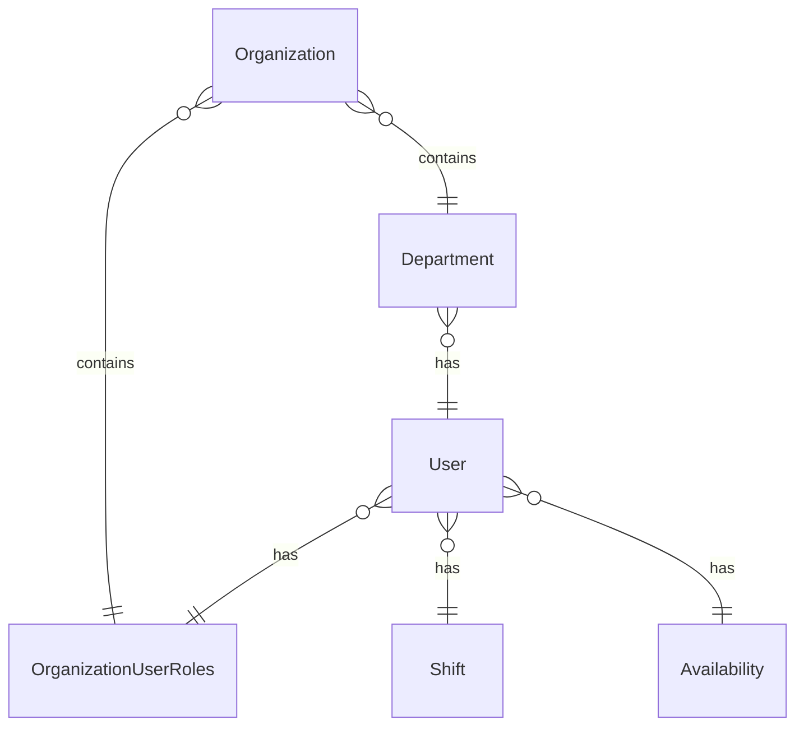

# Schedulo - hospitals

## Dev

Run `./gradlew bootRun`

Then you can proceed to a browser `http://localhost:8080/graphiql`

## Local Docker tests

`docker build --build-arg mongodb_uri="..." -t test .`
`docker rm test`
`docker run --name test -p 8080:8080  test`