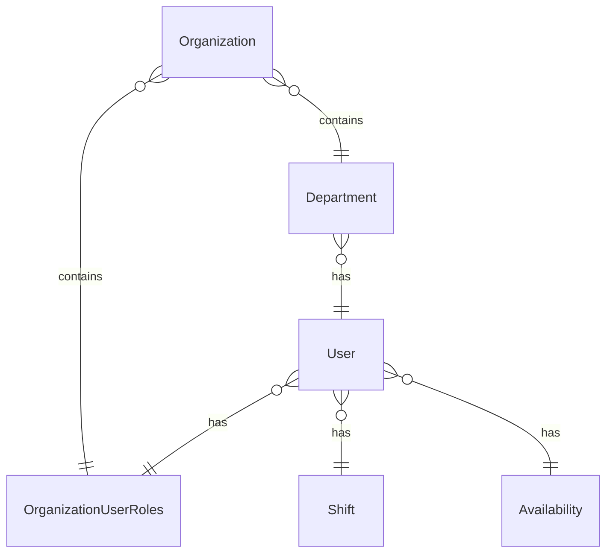

# Schedulo - hospitals

## Dev

Run `./gradlew bootRun`

Then you can proceed to a browser `http://localhost:8080/graphiql`

```mermaid
erDiagram
Organization }o--|| Department : contains
Department }o--|| User : has

Organization }o--|| OrganizationUserRoles : contains
User }o--|| OrganizationUserRoles : has
User }o--|| Shift : has
User }o--|| Availability : has

```
